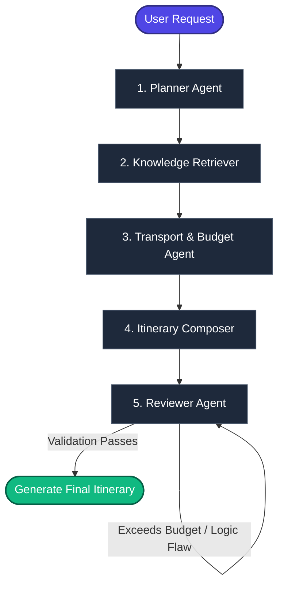

# ✈️ TripSaga (TripSage AI)

[](https://tripsaga.streamlit.app/)
[](https://www.python.org/)
[](https://fastapi.tiangolo.com/)
[](https://github.com/langchain-ai/langgraph)
[](https://www.trychroma.com/)

**TripSaga** (also referred to as **TripSage AI**) is an advanced, production-grade **Multi-Agent Travel Planning System** tailored for South India. Built using a state-of-the-art multi-agent state machine via **LangGraph**, **FastAPI**, **ChromaDB**, and **Streamlit**, it provides travelers with highly curated, budget-optimized, and context-aware itineraries.

🔗 **Live Web Application:** [tripsaga.streamlit.app](https://tripsaga.streamlit.app/)  
📄 **Design Document (Detailed Architecture & Design Specs):** Check [TripSage_AI_Design_Document.pdf](file:///e:/Projects/TripSaga/TripSage_AI_Design_Document.pdf) or [TripSage_AI_Design_Document.docx](file:///e:/Projects/TripSaga/TripSage_AI_Design_Document.docx) in the project root.

---

## 🗺️ System Architecture

TripSaga employs a cyclic/sequential **Multi-Agent State Machine** built on LangGraph. The shared graph state (`TripState`) flows progressively through five specialized agents, each executing specific programmatic or generative tasks.



### The 5-Agent Pipeline

1. **Planner Agent (Generative)**  
   Translates the user's travel destination, duration, and interests into semantic search queries optimized for vector database retrieval.
2. **Knowledge Retriever (Hybrid)**  
   Queries a local **ChromaDB** vector database to find matching attractions, hotels, and restaurants. 
   - **Multi-City Support**: For trips of $\ge$ 4 days, it calculates coordinates using a Haversine formula and queries nearby cities (within 150 km) to support multi-stop plans.
   - **Wikipedia Fallback**: If ChromaDB yields no local records, it queries the Wikipedia REST API to scrape city information dynamically.
3. **Transport + Budget Agent (Deterministic)**  
   Queries a local relational SQLite database (`distances.db`) to obtain precise driving distances, durations, and costs.
   - Computes lodging, dining, and transport costs based on real data matrices.
   - Maps domestic and international airport hubs (e.g. MAA, BLR, HYD, COK) and flags long transit times ($\ge$ 8 hours driving) with recommendations to fly or take a train instead.
4. **Itinerary Composer (Generative)**  
   Synthesizes the retrieved places, hotels, restaurants, and transit options into a structured day-by-day itinerary (Morning, Afternoon, Evening, and Meals) without inventing arbitrary names.
5. **Reviewer Agent (Generative Guardrail)**  
   Acts as a quality checker. It validates the day count, checks for duplicates, and assesses the calculated costs against the user's budget limit. If the budget is exceeded, it rewrites descriptions to suggest budget hotels, street food, and free activities to stay within limits.

---

## ✨ Core Features

- **Multi-Agent Orchestration**: Seamless control flow and state management via **LangGraph**.
- **Local Semantic Embeddings**: Runs `all-MiniLM-L6-v2` locally using **SentenceTransformers** (384-dimensional vectors) with a persistent **ChromaDB** database for fast vector searching.
- **Relational Data Mapping**: An SQLite database pre-seeded with cost profiles and route listings for **69 South Indian cities**.
- **External API Fallbacks**: Integrated with **OSRM (OpenStreetMap Routing Machine) API** for real-time road routing, and **Wikipedia API** for automated destination overview scraping.
- **Strict Data Serialization**: Validation and type matching powered by **Pydantic** (`TripRequest`, `TripResponse`, `DayPlan`, `BudgetDetail`, `RouteDetail`).
- **Flexible LLM Backend**: Configurable to run using **Google Gemini** (`gemini-2.5-flash`), **Groq** (`llama-3.1-8b-instant`), or locally hosted **Ollama** (`llama3`).
- **Glassmorphic Streamlit Frontend**: Curated CSS stylings containing deep-gradient travel dashboard overlays, Outfit/Inter typography, animated sidebar control modules, and reactive hover cards.

---

## 📂 Codebase Layout

```directory
├── backend/
│   ├── app/
│   │   ├── agents/            # LangGraph Agents (Planner, Retriever, Composer, etc.)
│   │   │   ├── state.py       # TypedDict shared state definition
│   │   │   └── ...
│   │   ├── api/
│   │   │   └── routes/
│   │   │       └── plan_trip.py # API endpoints exposing the agent graph
│   │   ├── core/
│   │   │   ├── config.py      # Environment variables & pydantic-settings
│   │   │   ├── db.py          # SQLite connection and OSRM/Haversine logic
│   │   │   ├── embeddings.py  # Local SentenceTransformer embeddings wrapper
│   │   │   ├── llm.py         # LLM provider initialization factory
│   │   │   └── vectorstore.py # Persistent ChromaDB operations
│   │   └── main.py            # FastAPI main application
│   └── data/
│       ├── build_transport_db.py # Script to initialize and seed SQLite table
│       ├── ingest_wikivoyage.py  # Script to read places and embed in ChromaDB
│       ├── distances.db          # Relational database (auto-bootstrapped)
│       ├── chroma_store/         # Persistent vector index (auto-bootstrapped)
│       ├── seed_places.json      # Structured destination metadata
│       └── transport_matrix.json # South India transit coordinates & costs
│
├── frontend/
│   └── streamlit_app.py       # Glassmorphic Streamlit user interface
│
├── requirements.txt           # Main python dependencies list
├── .env                       # Environment variables config (gitignored)
└── README.md                  # System overview & guidelines
```

---

## ⚡ Getting Started (Local Setup)

Follow these steps to run the application locally on your machine.

### 1. Prerequisites
- **Python 3.9, 3.10, or 3.11** installed.
- (Optional) **Ollama** installed locally if you plan to run open-source models without API keys.

### 2. Clone and Setup Environment
Open your terminal and execute:

```bash
# Clone the repository
git clone https://github.com/<your-username>/TripSaga.git
cd TripSaga

# Create a virtual environment
python -m venv venv

# Activate the virtual environment
# On Windows:
.\venv\Scripts\activate
# On macOS/Linux:
source venv/bin/activate

# Install dependencies
pip install -r requirements.txt
```

### 3. Configure Environment Variables
Create a file named `.env` in the root folder of the project. Copy the template from `.env.example` (or use the template below):

```ini
# Choose 'gemini', 'groq', or 'ollama'
LLM_PROVIDER=gemini

# Google Gemini Settings (Get key at https://aistudio.google.com/)
GEMINI_API_KEY=your_actual_gemini_api_key
GEMINI_MODEL=gemini-2.5-flash

# Groq default model configs (Get key at https://console.groq.com)
GROQ_API_KEY=your_groq_api_key_here
GROQ_MODEL=llama-3.1-8b-instant

# Ollama local settings (If LLM_PROVIDER=ollama)
OLLAMA_BASE_URL=http://localhost:11434
OLLAMA_MODEL=llama3
```

---

## 🚀 Running the Application

You can execute TripSaga in one of two configurations:

### Option A: Combined Execution (Frontend + Local In-Process Pipeline)
The Streamlit app is fully self-contained. When executed, it checks for SQLite and ChromaDB databases and automatically runs seeding scripts (`build_transport_db.py` and `ingest_wikivoyage.py`) if they are missing. It then invokes the LangGraph state machine directly in-process.

To start:
```bash
streamlit run frontend/streamlit_app.py
```
Open your browser and navigate to `http://localhost:8501`.

---

### Option B: Decoupled Execution (FastAPI Backend + Streamlit Frontend)
If you want to run the system as a decoupled service API:

1. **Launch the FastAPI Server**:
   ```bash
   uvicorn backend.app.main:app --reload --host 127.0.0.1 --port 8000
   ```
   - Swagger documentation is available at `http://127.0.0.1:8000/docs`
   - Re-route queries to `POST http://127.0.0.1:8000/api/plan`

2. **Launch the Streamlit App**:
   Configure the frontend to direct requests to the FastAPI endpoint (or run in-process as in Option A).

---

## 🔌 API Reference (FastAPI Backend)

### Generate Travel Itinerary
* **Endpoint:** `POST /api/plan`
* **Content-Type:** `application/json`

#### Request Schema (`TripRequest`)
```json
{
  "origin": "Bengaluru",
  "destination": "Madurai",
  "days": 3,
  "budget": 15000,
  "transport_pref": "train",
  "interests": ["temples", "history", "food"]
}
```

#### Response Schema (`TripResponse`)
```json
{
  "origin": "Bengaluru",
  "destination": "Madurai",
  "days": 3,
  "budget_limit": 15000,
  "route": {
    "mode": "train",
    "duration_hours": 7.5,
    "cost_inr": 850,
    "route_type": "direct_rail",
    "origin_airport": "Kempegowda International Airport (BLR)",
    "destination_airport": "Madurai Airport (IXM)",
    "warning": null
  },
  "budget_breakdown": {
    "transport_cost": 1700,
    "hotel_cost": 4400,
    "food_cost": 1800,
    "total_cost": 7900
  },
  "itinerary": {
    "Day 1": {
      "morning": "Arrival in Madurai. Check in at Hotel Supreme. Visit the magnificent Meenakshi Amman Temple...",
      "afternoon": "Enjoy a traditional South Indian lunch...",
      "evening": "Stroll down the local markets...",
      "meals": {
        "breakfast": "Traditional idli/dosa at Murugan Idli Shop",
        "lunch": "Meals at Bawarchi Restaurant",
        "dinner": "Local delicacies at hotel restaurant"
      }
    }
  },
  "review_notes": []
}
```

---

## 🛠️ Tech Stack

- **Orchestration**: `langgraph`, `langchain-core`
- **Inference Providers**: `google-genai` (Gemini), `groq` (Llama), `ollama` (Local)
- **Vector Search**: `chromadb` with `sentence-transformers` (`all-MiniLM-L6-v2`)
- **Web APIs**: `fastapi`, `uvicorn`, `httpx` (OSRM & Wikipedia integrations)
- **Frontend App**: `streamlit` (utilizing custom viewport responsive styling and dark mode glassmorphism tags)